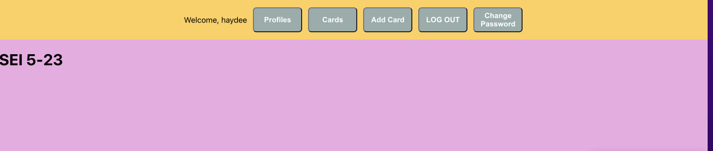
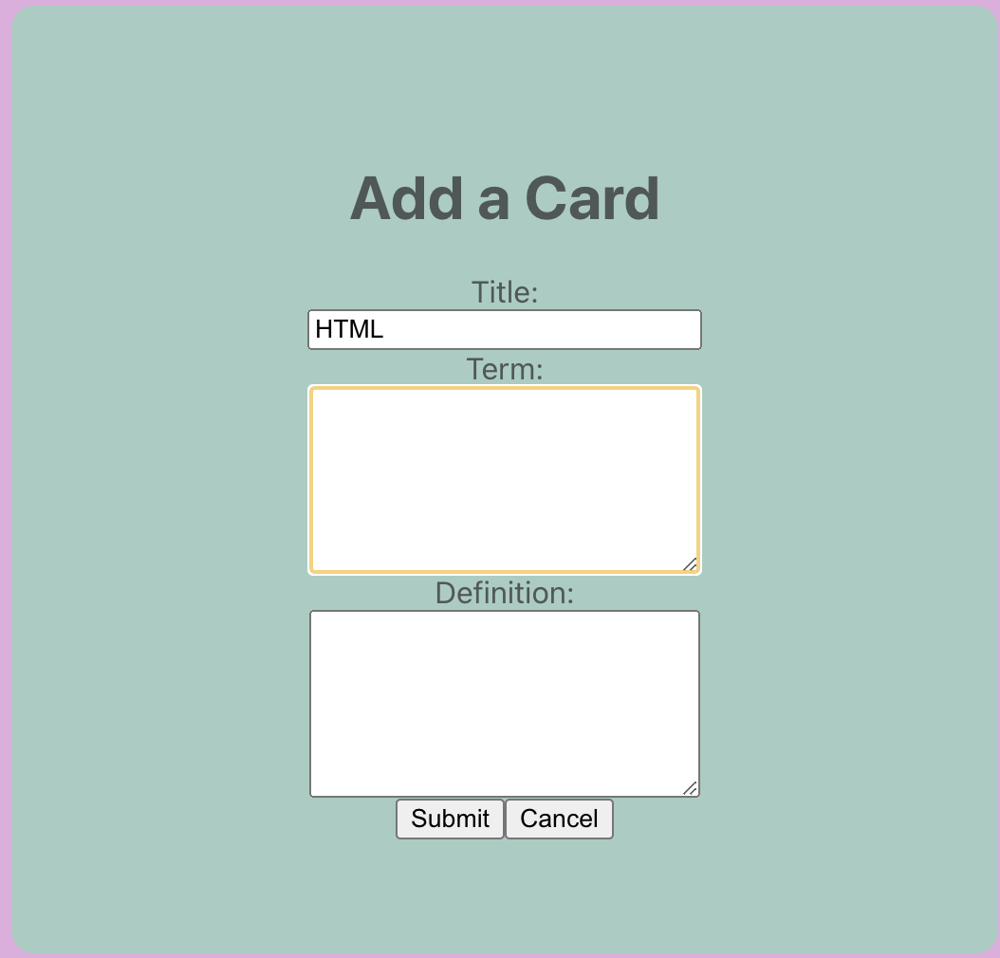
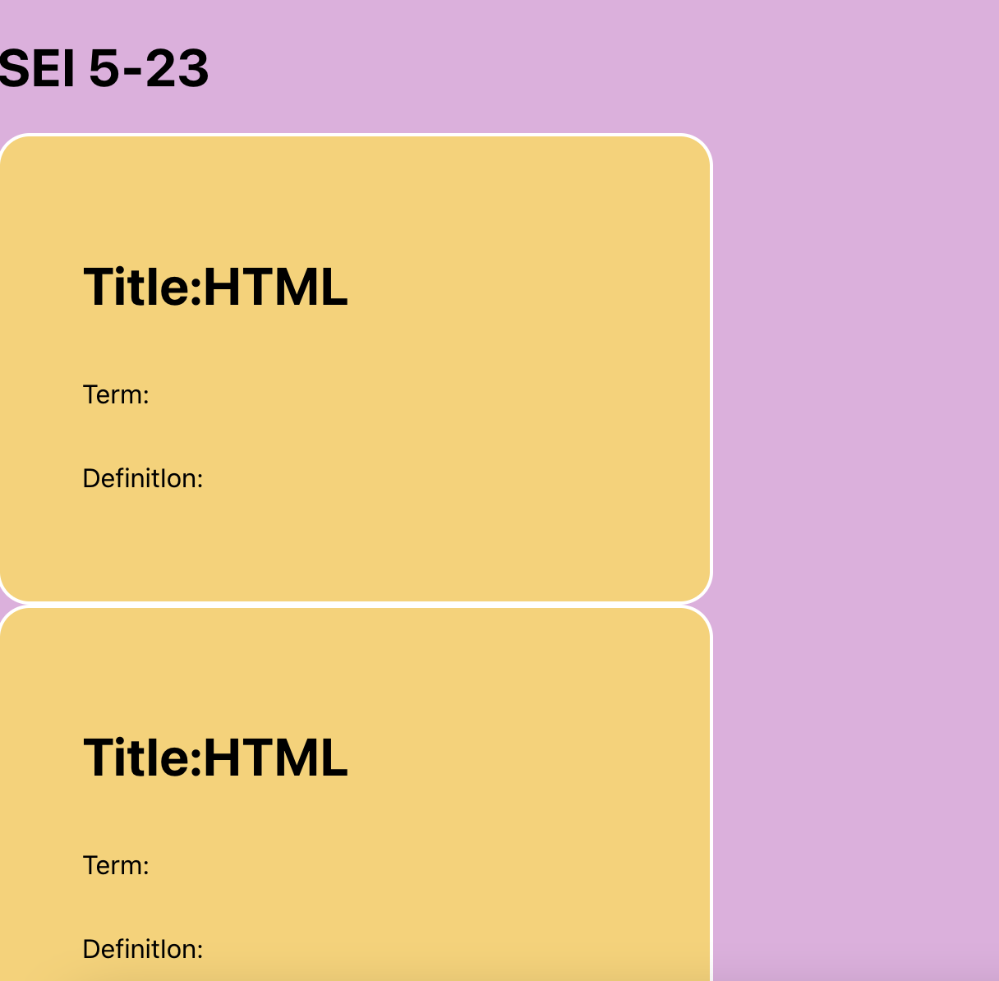
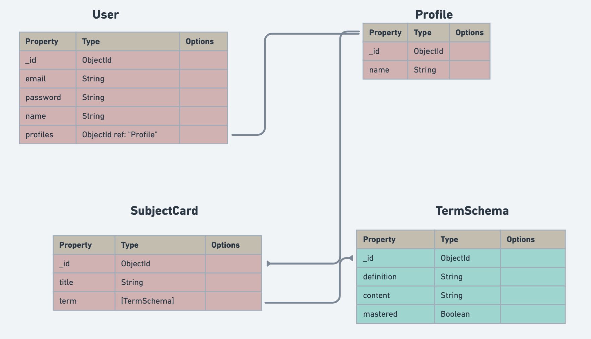

# PREP-FOR-REP

## The idea behind our app!
    We created this app to have an effective study tool for each unit of the GA-SEI course. This will allow us to have all of our important class materials in one place and at the same time allow us to review and go over the terms for each unit.

-----------------

  ## Getting Started 
  → <a href="https://whimsical.com/prepfortherep-MqYXVwA7bg467JHSHsaFDB"> Planning materials </a>
   

 →  <a href="https://github.com/dlobera/prepfortherep-back-end.git">GitHub BackEnd Repo</a>

 ----------
 ##   Contributors   
 ##### Github link ⇣

<a href="https://github.com/haaayd">Haydee Ramirez</a> ♡

<a href="https://github.com/dlobera">Dahlia Lobera</a> ♡

--------

## Technology Used 

-------------

## 🧊 Box  
 

𐄂 Have subjects displayed in one page and by clicking the title it will display all the card terms

𐄂 create a quiz option to be able to study the terms in the subject card 

